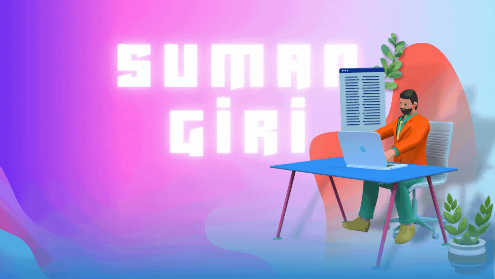

  
<!--    -->

## Hi, My name is Suman Giri
check these for motivation👇

# Profile Visits 🫶   

<!-- # ------------------------ -->
Full-Stack Web Developer
------------------------

An aspiring Full-Stack Web Developer, who can't help himself from falling in love with coding.  

* 🌍  I'm based in Odisha, India
* ✉️  You can contact me at [girisuman289@gmail.com](mailto:girisuman289@gmail.com)
* 🚀  I'm currently working on [PluralSight](http://pluralsight-clone-1.netlify.app/)
* 👨‍💻  I'm learning React
* 🤝  I'm open to collaborating on Interesting Projects
* 💫  Physics + Coding = 🤍

### Skills 🧠 

  

 

 <a href="https://redis.io" target="_blank" rel="noreferrer"> 

### Socials 🤝 

       

### Badges ⭐️  

<b>My GitHub Stats</b>

 &nbsp; &nbsp; 

### Spotify Playing 🎧   

  
  
 ### Random Coding Jokes 👻  
 
 
  

If you like what i do, maybe consider buying me a coffee/tea 🥺👉👈  
 
  

